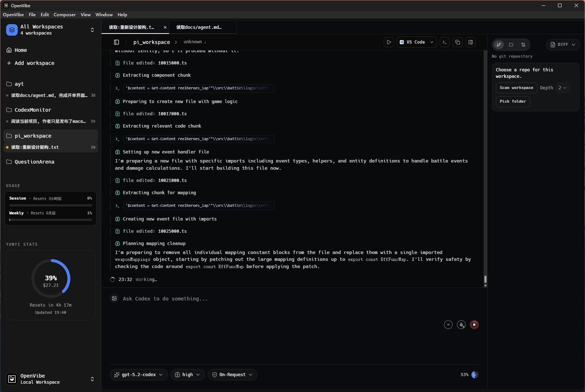

# Open Vibe

<div align="center">
  
  <h1>Open Vibe：多 Agent 桌面工作区</h1>
  <p>
    <a href="https://github.com/open-vibe/open-vibe"></a>
    
    
    
    
    
    <a href="https://github.com/open-vibe/nanobot-rs"></a>
  </p>
</div>

English version: [README.md](README.md)

> **nanobot 是一个超轻量的个人 AI 助手，灵感来自 [Clawdbot](https://github.com/openclaw/openclaw)。**
>
> Open Vibe 已集成 Rust 版本实现：**[open-vibe/nanobot-rs](https://github.com/open-vibe/nanobot-rs)**。

## ✨ 为什么是 Open Vibe

- 🚀 **多 Agent 编排**：在本地工作区 / worktree / clone 间高效协作。
- 🧠 **原生 Codex app-server 流程**：线程、审批、恢复、流式事件完整支持。
- 🤝 **桥接通道**：Happy 移动端接力 + Nanobot DingTalk 接力指令。
- 🗂️ **线程标签页与快速切换**：每个 tab 状态可持久化。
- 🛠️ **深度 Git/GitHub 工作流**：状态、diff、日志、分支、PR 上下文整合。
- 🎛️ **桌面生产力体验**：可调面板、终端 dock、主题、快捷键、语音听写。

## 🧩 核心能力

### 🏢 工作区与线程

- 持久化管理工作区，支持分组、排序、活动追踪。
- 每个工作区独立启动 `codex app-server`，支持列表/恢复/归档线程。
- 线程支持置顶、重命名、未读/运行状态提示。
- 支持 worktree 和 clone，隔离不同任务线。

### 💬 编辑器与 Agent 控制

- 富编辑输入：图片选择、拖放、粘贴、队列发送。
- 自动补全：技能（`$`）、提示词（`/prompts:`）、审阅（`/review`）、路径（`@`）。
- 集成模型、推理强度、访问模式、协作模式控制。
- 完整处理审批流程与消息条目（message/tool/reasoning/diff）。

### 🔗 Nanobot + DingTalk（Bridge）

- Bridge 模式可将 DingTalk 入站消息路由到 Open Vibe 线程。
- 默认目标：当前工作区。
- 已支持接力控制指令：
  - `/menu`
  - `/mode bridge`
  - `/mode agent`
  - `/relay`
  - `/relay <number>`

## 🏗️ 技术栈

- **前端：** React + Vite + TypeScript
- **桌面运行时：** Tauri 2
- **后端：** Rust（Tokio 异步）
- **协议：** Codex app-server JSON-RPC over stdio
- **桥接：** Happy bridge + Nanobot bridge daemon

## ⚙️ 环境要求

- Node.js + npm
- Rust stable 工具链
- CMake（非 Windows 听写相关依赖需要）
- 系统可执行 `codex`（或在设置中配置路径）
- Git CLI（必需）
- GitHub CLI `gh`（可选，用于 GitHub 面板）

## 🚀 快速开始

```bash
npm install
npm run tauri dev
```

## 📦 构建

```bash
npm run tauri build
```

Windows（可选）：

```bash
npm run tauri:build:win
```

## 🧪 校验

```bash
npm run lint
npm run test
npm run typecheck
```

## 📁 项目结构

```text
src/
  features/         功能切片 UI + hooks
  services/         Tauri IPC 封装 + 事件中心
  styles/           分区域样式与主题
  types.ts          前端共享类型
src-tauri/
  src/lib.rs        Tauri 后端组合入口
  src/codex.rs      Codex app-server 客户端逻辑
  src/nanobot_bridge.rs
  src/nanobot_bridge_daemon.rs
  src/happy_bridge.rs
```

## 📌 说明

- 配置保存在应用数据目录：`settings.json`。
- 工作区保存在应用数据目录：`workspaces.json`。
- 线程恢复按 workspace `cwd` 做过滤。
- 选择线程会触发 `thread/resume` 刷新。
- 自定义提示词从 `$CODEX_HOME/prompts` 读取。

## ⭐ Star History

[](https://www.star-history.com/#open-vibe/open-vibe&type=date&legend=top-left)
